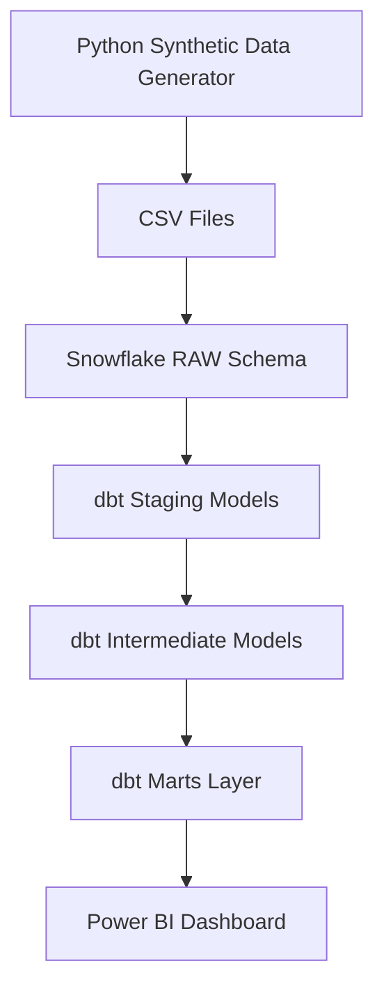
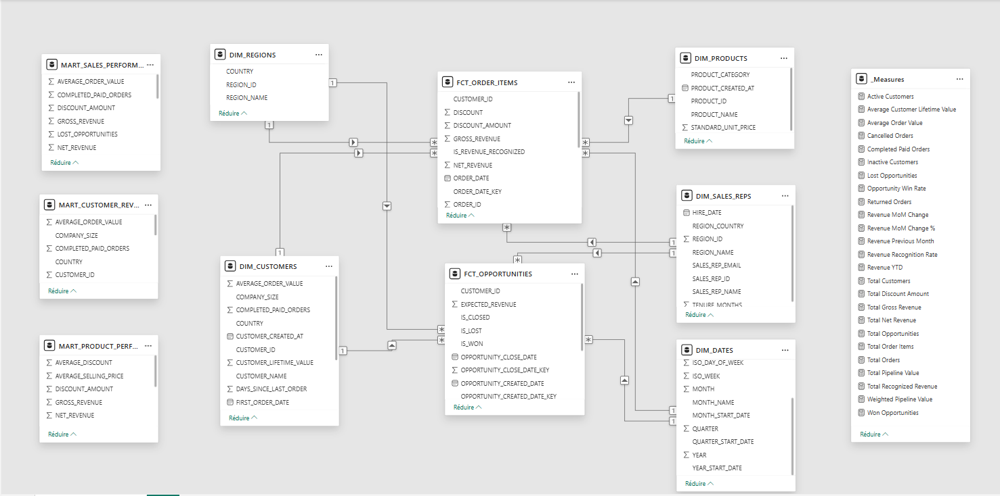
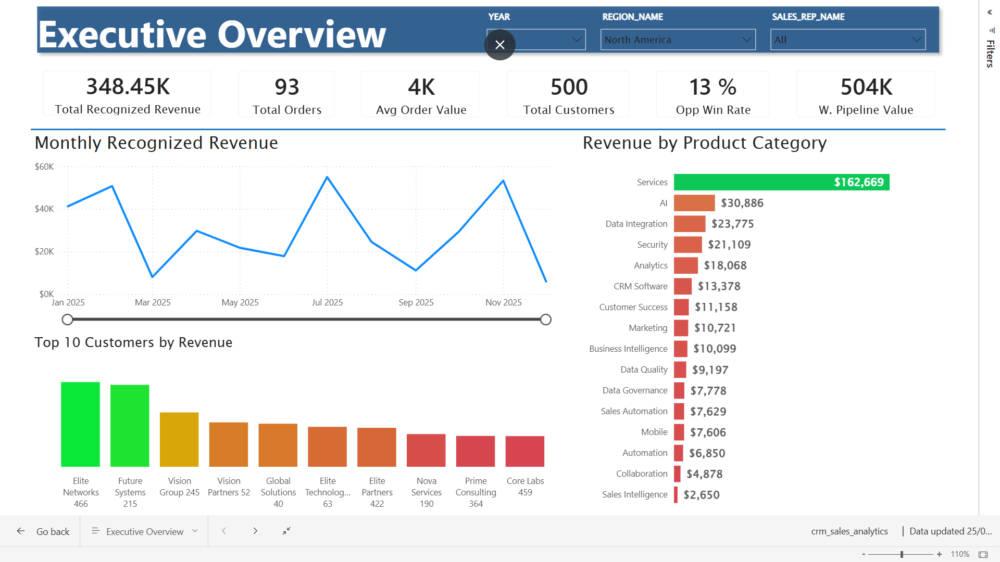
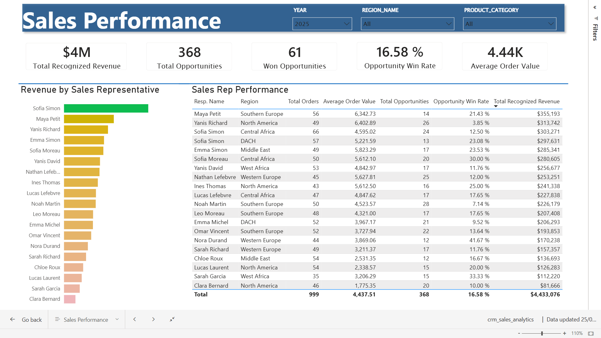
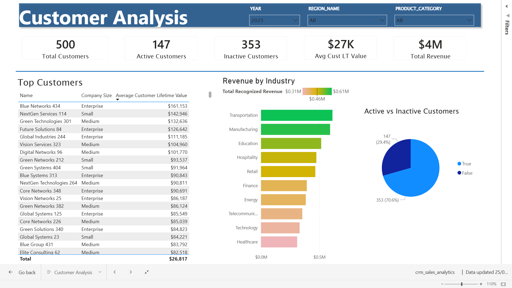
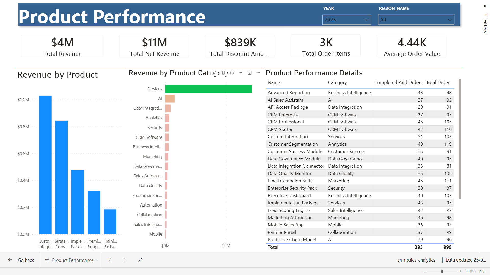
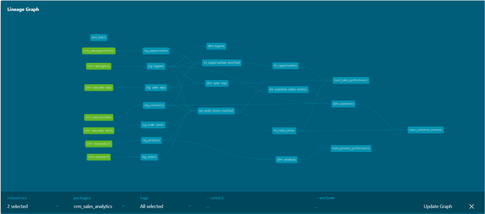

# CRM Sales Analytics Platform

An end-to-end **Analytics Engineering** project that turns raw CRM sales data into clean, tested, documented, and business-ready analytics models for **Power BI**.

## Recruiter Summary

This project demonstrates my ability to work across the analytics engineering workflow:

- data generation and ingestion;
- Snowflake warehouse modeling;
- dbt transformations;
- staging, intermediate, fact, dimension, and mart models;
- data quality tests;
- metric validation;
- Power BI dashboarding;
- business-oriented analytics storytelling.

It simulates the kind of work an Analytics Engineer or technical Data Analyst would do to transform raw CRM data into trusted business reporting.

## Overview

This project simulates a modern B2B sales analytics stack to analyze:

- Revenue (recognized / gross / net)
- Customers and customer lifetime value
- Products and categories
- Regions
- Sales representative performance
- Opportunities and pipeline conversion

## Business Problem

The sales leadership team needs better visibility into sales performance.

The company wants to answer questions such as:

- How much revenue are we generating?
- Which customers generate the most value?
- Which products and categories drive revenue?
- Which regions are performing best?
- Which sales representatives perform best?
- What is the opportunity win rate?
- What is the weighted value of the sales pipeline?

## Solution

The project builds a complete analytics workflow:

1. Generate synthetic CRM data with Python.
2. Load raw CSV files into Snowflake.
3. Store source data in a RAW schema.
4. Transform data with dbt.
5. Build staging, intermediate, fact, dimension, and mart models.
6. Connect Power BI to the Snowflake MARTS layer.
7. Build a four-page sales analytics dashboard.

## Architecture




## Data Model (Star Schema)

The marts layer follows a star schema design.

### Core Marts

- Dimensions: `dim_customers`, `dim_products`, `dim_regions`, `dim_sales_reps`, `dim_dates`
- Facts: `fct_order_items`, `fct_opportunities`

### Business Marts

- `mart_sales_performance`
- `mart_customer_revenue`
- `mart_product_performance`



### Main Business Rule

Recognized revenue is counted only for completed and paid orders:

```text
recognized_revenue = quantity * unit_price * (1 - discount)
```

## Power BI Dashboard

The final analytics layer is visualized in Power BI.

The dashboard connects to the Snowflake `MARTS` schema and provides four pages:

- Executive Overview
- Sales Performance
- Customer Analysis
- Product Performance

Dashboard file:

```text
dashboards/powerbi/crm_sales_analytics_dashboard.pbix
```

### Screenshots

#### Executive Overview



#### Sales Performance



#### Customer Analysis



#### Product Performance



## Getting Started

### 1) Generate Synthetic Data (CSV)

Install Python dependencies:

```bash
python -m venv .venv
source .venv/bin/activate
pip install -r requirements.txt
```

Generate raw CSV files:

```bash
python scripts/generate_crm_data.py
```

Output directory:

```text
data/raw/
```

### 2) Snowflake Setup (RAW Layer)

Snowflake SQL scripts are provided in:

```text
snowflake/
```

Typical execution order:

1. `create_database.sql`
2. `create_stage.sql`
3. `create_raw_tables.sql`
4. `load_data.sql`

### 3) Build dbt Models

Run dbt (staging + intermediate + marts + tests):

```bash
cd dbt/crm_sales_analytics
dbt build
```

Lineage / DAG view (example):



## Documentation

- Architecture: [docs/architecture.md](docs/architecture.md)
- Business requirements: [docs/business_requirements.md](docs/business_requirements.md)
- Data generation: [docs/data_generation.md](docs/data_generation.md)
- Snowflake RAW layer: [docs/snowflake_raw_layer.md](docs/snowflake_raw_layer.md)
- dbt staging layer: [docs/dbt_staging_layer.md](docs/dbt_staging_layer.md)
- dbt marts layer: [docs/dbt_marts_layer.md](docs/dbt_marts_layer.md)
- Power BI dashboard: [docs/powerbi_dashboard.md](docs/powerbi_dashboard.md)
- Metrics validation (Power BI vs Snowflake): [docs/metrics_validation.md](docs/metrics_validation.md)
- Data dictionary: [docs/data_dictionary.md](docs/data_dictionary.md)
- Project summary: [docs/project_summary.md](docs/project_summary.md)

## License

See `LICENSE`.