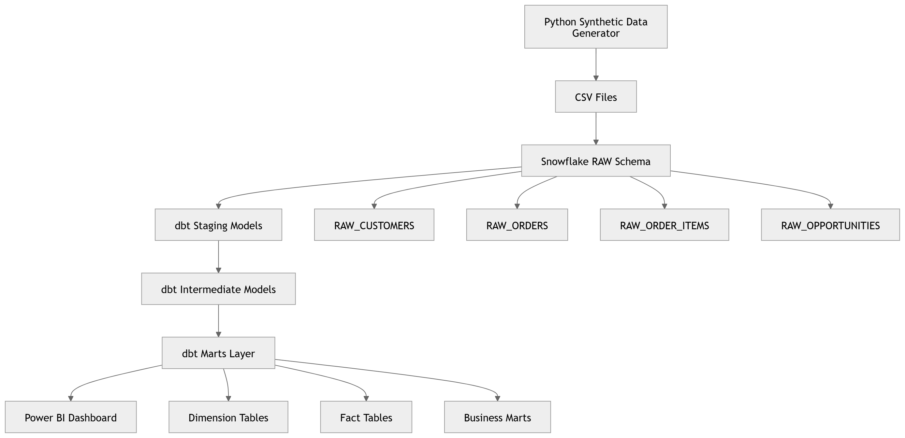

# Architecture

## Overview

This project follows a layered analytics architecture.

The goal is to separate raw data storage, data cleaning, business transformation, and reporting.

## Architecture Flow

```text
Synthetic CRM Data
        ↓
CSV Files
        ↓
Snowflake RAW Schema
        ↓
dbt Staging Models
        ↓
dbt Intermediate Models
        ↓
dbt Marts Layer
        ↓
Power BI Dashboard
```

## Layers

### 1. Source Layer

Synthetic CRM data is generated using Python and exported as CSV files.

Files generated:

- `customers.csv`
- `products.csv`
- `regions.csv`
- `sales_reps.csv`
- `orders.csv`
- `order_items.csv`
- `opportunities.csv`

### 2. RAW Layer

The RAW layer stores data in Snowflake with minimal transformation.

Schema:

```text
CRM_SALES_ANALYTICS.RAW
```

Purpose:

- preserve source structure
- provide a stable landing zone
- avoid applying business logic too early

### 3. Staging Layer

The staging layer is built with dbt.

Schema:

```text
CRM_SALES_ANALYTICS.STAGING
```

Purpose:

- rename columns
- cast data types
- trim text fields
- standardize column names
- prepare clean source models

### 4. Intermediate Layer

Intermediate models contain reusable transformation logic.

Examples:

- enriched order items
- enriched opportunities
- customer order metrics

Purpose:

- avoid duplicated business logic
- simplify downstream marts
- prepare reusable calculations

### 5. Marts Layer

The marts layer contains analytics-ready tables.

Schema:

```text
CRM_SALES_ANALYTICS.MARTS
```

It includes:

- dimensions
- facts
- business marts

### 6. BI Layer

Power BI connects to the Snowflake MARTS schema.

The dashboard provides four views:

- Executive Overview
- Sales Performance
- Customer Analysis
- Product Performance

## Data Model

The project uses a star schema.

Main fact tables:

| Table | Grain |
|---|---|
| `fct_order_items` | One row per order item |
| `fct_opportunities` | One row per commercial opportunity |

Main dimensions:

- `dim_customers`
- `dim_products`
- `dim_sales_reps`
- `dim_regions`
- `dim_dates`

---

## Architecture Diagram

